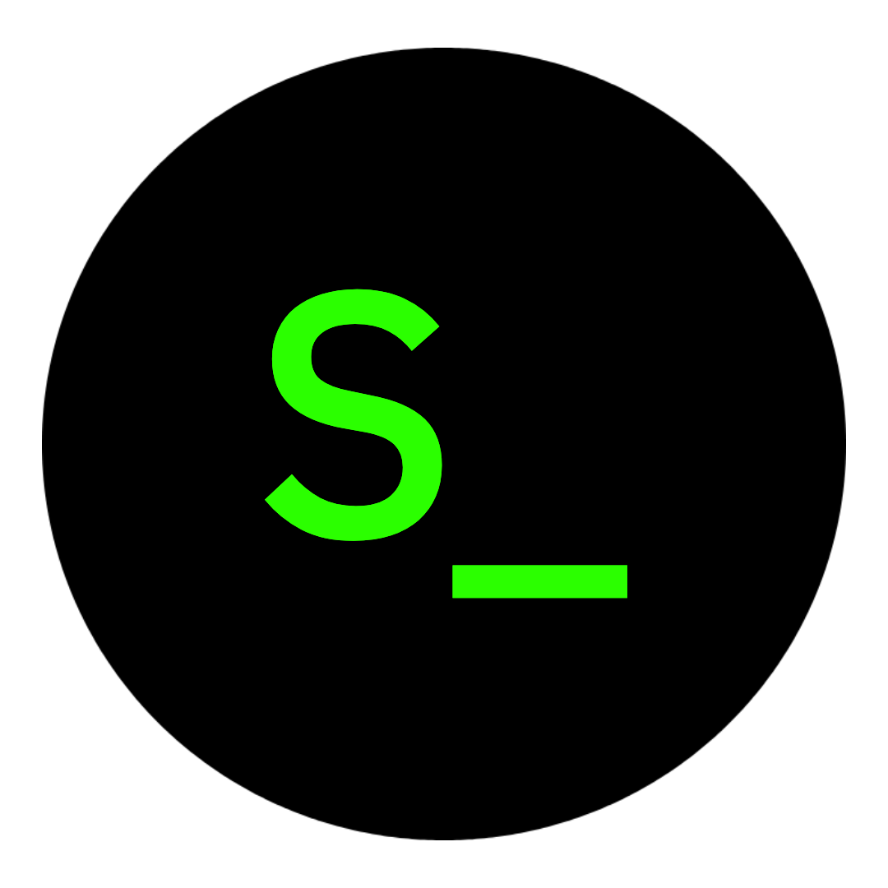

<p align="center">
  
</p>

<h1 align="center">ShellOS</h1>

<p align="center">
  Um sistema operacional minimo feito do zero em Assembly e C,<br>
  com módulos em Rust e shell interativo.
</p>

<p align="center">
  
  
  
  
</p>

---

## Sobre

**ShellOS** é um sistema operacional básico construído do zero com fins educacionais.
Possui bootloader próprio, kernel chamado **Basix**, shell interativo, sistema de
arquivos em memória RAM, editor de texto integrado, interface gráfica TUI e instalador.

> **Nota:** O kernel Basix é um kernel educacional minimalista inspirado no POSIX.
> O projeto está migrando para Linux como base para amadurecer o sistema.

<p align="center">
  
  <br>
  <i>Basix — o kernel educacional do ShellOS</i>
</p>

---

## Estrutura do projeto

| Arquivo | Descrição |
|---------|-----------|
| `bootloader.asm` | Bootloader em Assembly x86 — inicializa o sistema e carrega o kernel |
| `entry.asm` | Entry point do kernel — ponto de entrada em 32 bits |
| `kernel.c` | **Basix** — driver VGA, teclado PS/2, scroll, inicialização |
| `shell.c` | Loop do shell, leitura de input e parser de comandos |
| `commands.c` | Implementação de todos os comandos do shell |
| `fs.c` | Sistema de arquivos em RAM — diretórios e arquivos voláteis |
| `write.c` | Editor de texto minimalista integrado ao shell |
| `makeux.c` | Interface gráfica TUI estilo Windows 1.0 |
| `shinstall.c` | Instalador visual com seleção de idioma, teclado e particionamento |
| `keymap.c` | Layouts de teclado — ABNT2, QWERTY US, QWERTZ DE, AZERTY FR |
| `ata.c` | Driver ATA — leitura e escrita no disco |
| `partition.c` | Particionador — escreve tabela MBR no disco |
| `linker.ld` | Script de linkagem — define layout do kernel na memória |
| `Makefile` | Compilação, empacotamento e execução |
| `memman/` | Módulo de gerenciamento de memória escrito em **Rust** |

---

## Comandos disponíveis

| Comando | Descrição |
|---------|-----------|
| `help` | Lista todos os comandos |
| `clear` | Limpa a tela |
| `echo <texto>` | Imprime texto na tela |
| `ls` | Lista diretórios e arquivos |
| `mkdir <nome>` | Cria um diretório |
| `rm <dir>/<arq>` | Remove um arquivo |
| `write <arq>` | Abre o editor de texto (F2 salvar, F10 sair) |
| `makeux` | Abre a interface gráfica TUI |
| `shinstall` | Instala o ShellOS no disco |
| `mem` | Informações de memória do kernel |
| `ver` | Versão do ShellOS |
| `halt` | Desliga o sistema |

---

## MakeUX — Interface Gráfica

| Tecla | Ação |
|-------|------|
| `F1` | Voltar ao shell |
| `F2` | Visualizar arquivos |
| `F3` | Informações de memória |
| `F10` | Sair do MakeUX |
| `F12` | Desligar o sistema |

---

## Layouts de teclado suportados

| Layout | Região |
|--------|--------|
| ABNT2 | Português (Brasil) |
| QWERTY | English (US) |
| QWERTZ | Deutsch (DE) |
| AZERTY | Français (FR) |

---

## Requisitos
```bash
sudo apt install nasm gcc make qemu-system-x86 xorriso
```

---

## Compilar e rodar
```bash
# compilar
make

# testar no QEMU (ambiente recomendado)
make run

# gerar pacotes (.img .vdi .iso)
make package
```

---

## Compatibilidade

| Ambiente | Status |
|----------|--------|
| QEMU | ✅ Testado e funcional |
| VirtualBox | ⚠️ Funcional, passivel de bugs |
| VMware | ⚠️ Sem garantia, possiveis falhas críticas |
| Hardware real | ⚠️ Sem garantia, não recomendável |

---

## Tecnologias

- **Assembly x86** — bootloader e entry point
- **C** — kernel Basix, shell, sistema de arquivos
- **Rust** — módulo de gerenciamento de memória (`memman`)

---

## Roadmap

- [x] Bootloader próprio
- [x] Kernel Basix
- [x] Shell interativo
- [x] Sistema de arquivos em RAM
- [x] Editor de texto
- [x] Interface gráfica TUI (MakeUX)
- [x] Instalador (ShInstall)
- [x] Driver ATA
- [x] Layouts de teclado
- [ ] Migração para kernel Linux
- [ ] Rede
- [ ] Sistema de arquivos persistente
- [ ] MakeUX completo

---

## Licença

MIT — livre para usar, modificar e distribuir.
Qualquer pessoa pode forkear e distribuir sua própria versão gratuitamente.

---

## Aviso

Projeto construído com auxílio de IA como ferramenta de aprendizado,
similar ao uso de documentação técnica e OSDev Wiki.
Desenvolvido no **Linux Mint** com **Visual Studio Code**.

---

## Observação

O Autor do projeto é um **estudante** de programação e linux, tenha paciencia com qualquer possivel erro!
